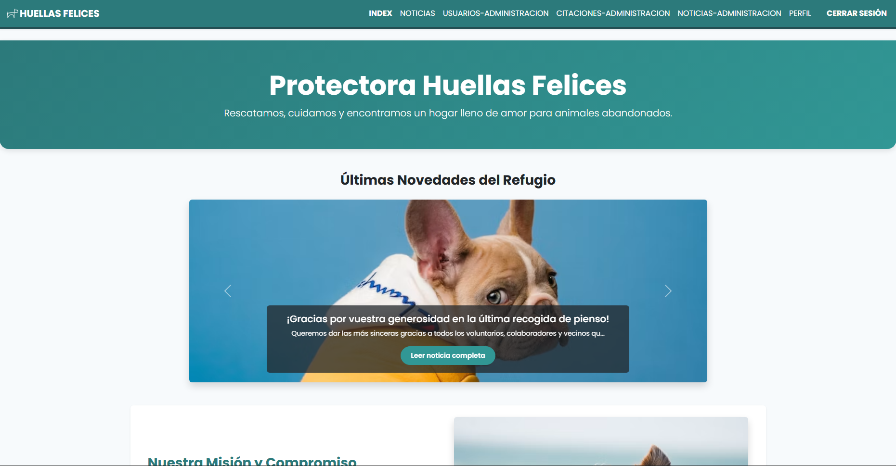
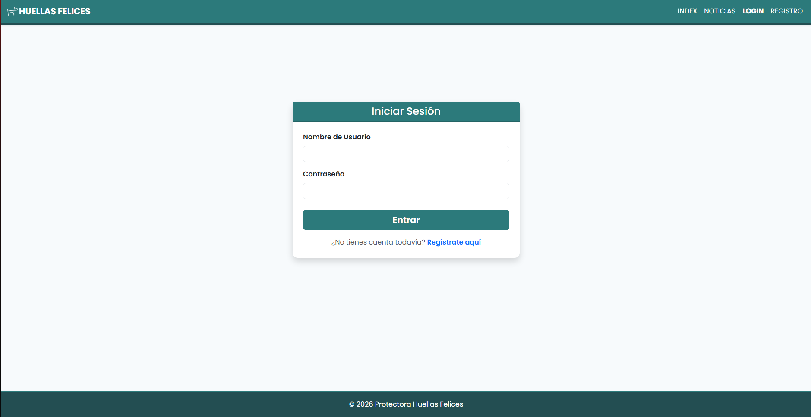
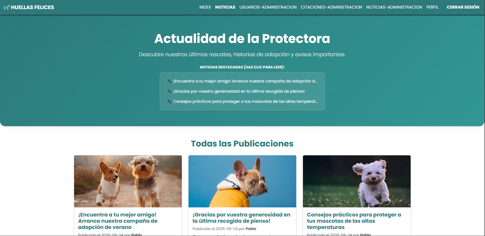
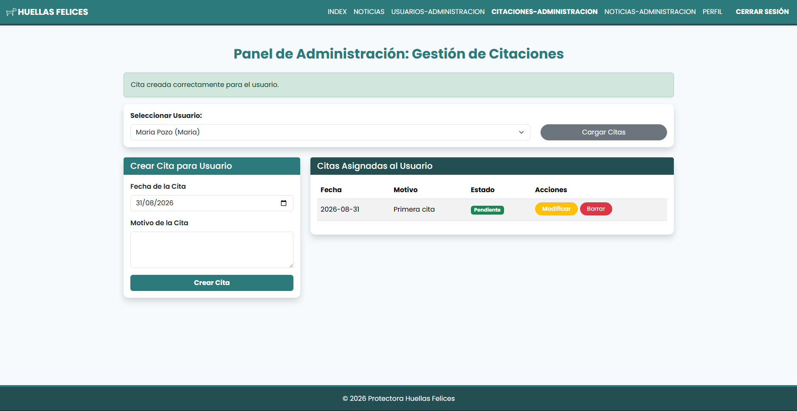
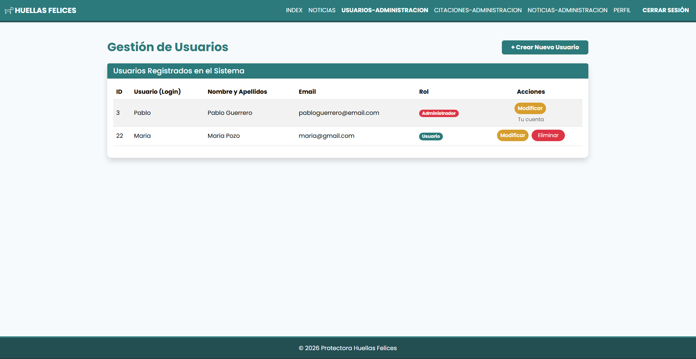

# 🐾 Huellas Felices

Aplicación web para la gestión de una protectora de animales, desarrollada con PHP y MySQL.

🌐 **[Ver demo online](https://protectora-huellas-felices.infinityfree.me)**

---

## 📋 Sobre el proyecto

**Huellas Felices** es una aplicación web desarrollada como proyecto final del **Curso Superior en Programación de Páginas Web**.

El proyecto simula el funcionamiento de una protectora de animales y permite gestionar usuarios, roles, citas y noticias mediante una aplicación web conectada a una base de datos relacional.

El objetivo principal ha sido aplicar de forma práctica los conocimientos adquiridos durante el curso, especialmente en **PHP, SQL, programación orientada a objetos, gestión de sesiones y conexión con bases de datos**.

---

## 🚀 Funcionalidades

### 👤 Usuarios

* Registro de nuevos usuarios.
* Inicio de sesión y cierre de sesión.
* Gestión y modificación del perfil.
* Cambio de contraseña.
* Solicitud de citas.
* Consulta de noticias.
* Eliminación de citas propias.

### 🔐 Administradores

* Panel de administración.
* Gestión de usuarios.
* Creación, modificación y eliminación de usuarios.
* Gestión de roles.
* Gestión de citas.
* Creación, modificación y eliminación de noticias.

---

## 🛠️ Tecnologías utilizadas

* **PHP** — lógica de servidor y gestión de la aplicación.
* **MySQL / MariaDB** — sistema gestor de base de datos.
* **SQL** — creación, consulta y gestión de datos.
* **HTML5** — estructura de las páginas.
* **CSS3** — estilos y diseño.
* **JavaScript** — funcionalidades e interactividad en el cliente.
* **Bootstrap 5.3.3** — diseño responsive y componentes de interfaz.
* **PDO** — conexión y acceso a la base de datos.
* **Git / GitHub** — control de versiones y publicación del proyecto.

---

## 🗄️ Base de datos

La aplicación utiliza una base de datos relacional formada por diferentes tablas relacionadas mediante claves primarias y foráneas.

Entre las principales tablas se encuentran:

* `users_data`
* `users_login`
* `citas`
* `noticias`

Se utilizan relaciones mediante **claves foráneas**, restricciones `UNIQUE` e índices para mantener la integridad de los datos.

El proyecto incluye un archivo SQL de demostración:

```text
database/proyecto_final.sql
```

---

## 🔐 Seguridad y buenas prácticas

El proyecto incorpora diferentes medidas y prácticas básicas de seguridad:

* Las contraseñas se almacenan mediante `password_hash()`.
* Las contraseñas se verifican mediante `password_verify()`.
* Se utilizan consultas preparadas mediante PDO.
* La configuración de la base de datos se mantiene fuera del repositorio mediante `.gitignore`.
* Se proporciona `.env.example.php` como plantilla de configuración.
* Se utilizan sesiones PHP para gestionar la autenticación.
* Se utiliza `htmlspecialchars()` en diferentes puntos de salida de datos para ayudar a evitar la inserción de HTML no deseado.
* Los datos incluidos en la base de datos pública son datos ficticios de demostración.

---

## 🏗️ Arquitectura del proyecto

El código se organiza separando diferentes responsabilidades:

* **Models** — acceso y gestión de los datos.
* **Controllers** — gestión de la lógica de las diferentes secciones.
* **Views** — interfaz que se muestra al usuario.
* **Assets** — archivos CSS, JavaScript e imágenes.

La conexión con la base de datos se centraliza mediante una clase `Connection` que utiliza PDO y reutiliza una única instancia de conexión.

---

## 📁 Estructura del proyecto

```text
huellas-felices/
│
├── database/
│   └── proyecto_final.sql
│
├── web/
│   ├── assets/
│   │   ├── css/
│   │   ├── img/
│   │   └── js/
│   │
│   ├── config/
│   │   └── .env.example.php
│   │
│   ├── controllers/
│   ├── models/
│   ├── views/
│   └── index.php
│
├── .gitignore
└── README.md
```

---

## ⚙️ Instalación

### 1. Clonar el repositorio

```bash
git clone https://github.com/PabloEstopero/huellas-felices.git
```

### 2. Crear la base de datos

Crear una base de datos MySQL/MariaDB e importar:

```text
database/proyecto_final.sql
```

### 3. Configurar la conexión

Crear una copia de:

```text
web/config/.env.example.php
```

y llamarla:

```text
.env.php
```

Después, configurar las credenciales correspondientes a la base de datos local.

### 4. Ejecutar el proyecto

Colocar la carpeta `web` en un servidor compatible con PHP, como Apache mediante XAMPP, y acceder a:

```text
http://localhost/huellas-felices/web/
```

---

## 🧪 Cuentas de demostración

Para probar las diferentes funcionalidades se incluyen cuentas ficticias:

### Administrador

```text
Usuario: admin_demo
Contraseña: DemoAdmin123!
```

### Usuario estándar

```text
Usuario: usuario_demo
Contraseña: DemoUser123!
```

---

## 🌐 Demo online
## 📸 Capturas de pantalla

### 🏠 Página principal



### 🔐 Inicio de sesión



### 📰 Noticias



### 📅 Gestión de citas



### 👨‍💼 Panel de administración




La aplicación está desplegada y disponible online:

**https://protectora-huellas-felices.infinityfree.me**

---

## 👨‍💻 Autor

**Pablo Guerrero Linares**

Desarrollador Web Junior en formación, interesado especialmente en desarrollo backend y bases de datos.

Este proyecto forma parte de mi portfolio y ha sido desarrollado como proyecto final del Curso Superior en Programación de Páginas Web.

[GitHub](https://github.com/PabloEstopero)
